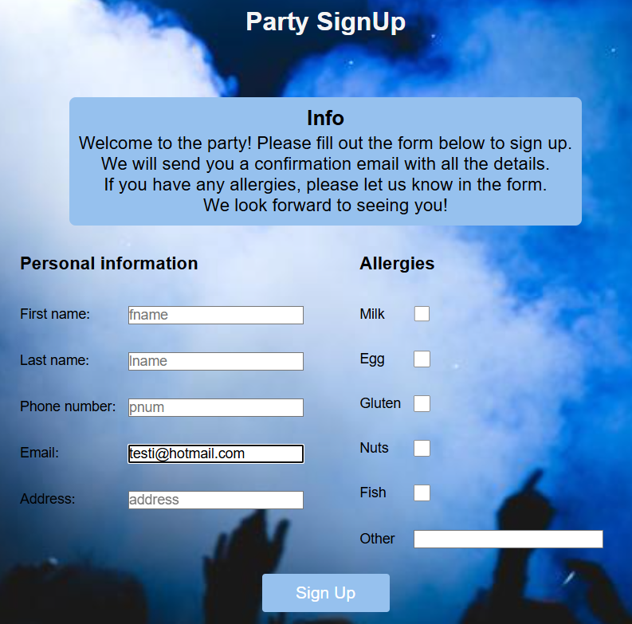
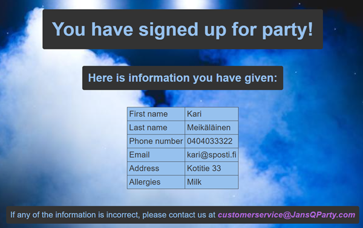
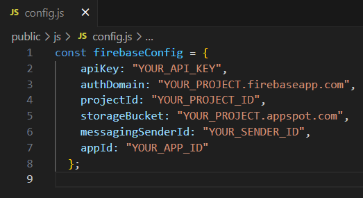

# Party SignUp

This is a web-application for signing up for party.
Application is hosted via Firebase and Firestore is used for storing the data.

## About web application

First user has to fill in an email address. 


If entered email address isn't stored at Firestore, web site opens a form for filling personal data and allergies. After user has filled in the data and clicks _"Sign Up"_ -button, this data is stored at Firestore. After succesfull submit, user is relocated to _"thank you"_ -page and can logout.



If user fills in an email address that is already stored at Firestore database, user can not fill in new data. Instead user is shown the information he/she has filled in before.



At the web site there is also navigation bar. Depending on current page, there are links for _"List of SignUp"_, _"About us"_, _"Back"_ and _"Logout"_

- **List of Sign Up**
    - Shows page with list of all signed up partygoers


- **About us**
    - Shows page with information about fictional company named JansQParty


- **Back**
    - Returns previous page
- **Logout**
    - User is logged out by clearing sessionstorage, page relocates to "login"

## About hosting with Firebase

#### Creating Firebase project

1. Go to [Firebase Console](https://console.firebase.google.com/)
2. Click "Create a Firebase project
3. Give a name to your project
4. Choose if you want to add AI assistance of Google Analytics for your project. These are optional
5. Click "Create project"

#### Adding Firestore to your project

1. From your projec's left sidebar choose "Build" > "Firestore Database"
2. Click "Create database" and choose location where data will be stored. This cannot be changed later on
3. Chooce secure rules
    - Production mode
        - data is private by default
    - Test mode
        - data is open by default
    - Mode can be changed later on, so I chose test mode for easier developement. Limitations should be added after developement is done.

#### Adding Firebase Web App to your project

1. Choose **</>** Web App icon from your project Overview
2. Give name to your app
3. Click "Register app"
    - You will get Firebase configuration information
    - Make new file to js -folder named "config.js" and copy the configuration information there
    

#### Install Firebase in your project and start hosting

1. Run these in the commandline
```
npm install -g firebase-tools
firebase login
firebase init
firebase init hosting
```
2. Answer questions
    - "Use an existing project?": choose your project
    -  "What do you want to use as your public directory?": write "public"
    - "Configure as a single-page app?": no
    - "Set up automatic builds...": no
    - If asked about overwriting index.html: answer no
4. Run this in the commandline
```
firebase deploy
```

## Links

- [PartySignUp](https://signup4party.web.app)
    - _link to web application hosted via Firestore_
- [tähän videolinkki](https://youtu.be/0FgJx9zbAdE)
   - _web-sivusto käyttöönotettiin Cloudflaren git -integraation avulla_

[]
