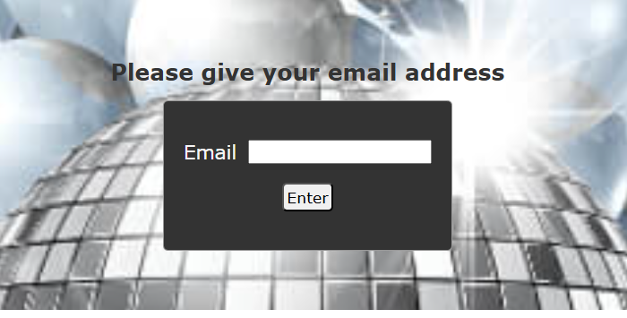

# PartySignUp

**PartySignUp** is a web application for signing up for a party.
The app is hosted via Firebase and data is stored in Firestore.

## About the application

The user begins by entering their email address. 



If the email **does not exist** in Firestore, the user is shown a form to fill in their personal information and any allergies. After clicking the _"Sign Up"_ button, the information is saved to Firestore. Upon successful submission, the user is redirected to a _"Thank You"_ page and can log out.


If the email **already exists** in the Firestore database, the user is shown the previously submitted information and cannot submit new data.


The application also includes a navigation bar. Depending on the current page, it displays links for:
- **List of SignUp** – shows a list of all users who have signed up.
- **About Us** – information about the fictional company JansQParty.
- **Back** – returns to the previous page.
- **Logout** – logs out the user by clearing session storage and redirecting to the login page

#### Screenshots

**List of SignUp**
    


**About us**


## Hosting with Firebase

Firebase offers both free and pay-as-you-go pricing plans. The free tier is sufficient for this project's requirements.


#### Setting Up Firebase

**Create a Firebase project**

1. Go to [Firebase Console](https://console.firebase.google.com/)
2. Click **_Create a Firebase project_**
3. Enter a name for your project
4. Choose if you want to add AI assistance of Google Analytics for your project. These are optional
5. Click **_Create project_**

**Add Firestore to your project**

1. From your projec's left sidebar navigate to **_Build > Firestore Database_**
2. Click **_Create database_** and choose location. This cannot be changed later on
3. Choose secure rules
    - **_Production mode_** – data is private by default
    - **_Test mode_** – data is public by default (recommended during development)
    > Mode can be changed later on. Test mode is easier during development but should be tightened for production.

**Add Firebase Web App to your project**
1. Click the **_Web App icon </>_** from your project overview
2. Enter a name for your app
3. Click **_Register app_**
4. Copy the provided configuration and paste it into a new file named `config.js` in your _js/_ folder
    

#### Installing Firebase tools and Deploying

1. Run the following in your terminal:
```
npm install -g firebase-tools
firebase login
firebase init
firebase init hosting
```
2. Answer the prompts:
    - "Use an existing project?": Select your project
    -  "What do you want to use as your public directory?": `public`
    - "Configure as a single-page app?": `no`
    - "Set up automatic builds?": `no`
    - If asked about overwriting _index.html_: Choose `no`
4. Deploy your app:
```
firebase deploy
```

## Links

- [Live App: PartySignUp](https://signup4party.web.app)
    - _Hosted on Firebase_
- [Demo Video](https://youtu.be/0FgJx9zbAdE)
   - _Demo video about the web application_

[]
